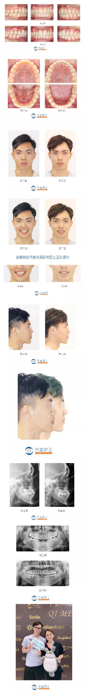

# Orthodontic-Case-Sharing
####  这可能是口腔界第一个Github项目

这些年一直奋斗在口腔正畸一线，经手过许多病人。日常都将这些病例直接分享到微博或者朋友圈，但这种做法不便于管理和维护。因此，建立此项目。将本人多年的临床牙齿矫正病历分享于此，希望能够给还在犹豫是否牙齿矫正的患者和奋战在一线的牙医们提供帮助和指导。

由于工作较忙，病例将会陆续整理和更新。

案例全部存放于：  /case              文件夹中

毕业合照存放于：  /graduation    文件夹中

####   <a href="https://github.com/NajunNiu/Orthodontic-Case-Sharing/blob/master/GRA.md/">毕业合集</a> 

## 案例

 
 

 
 

